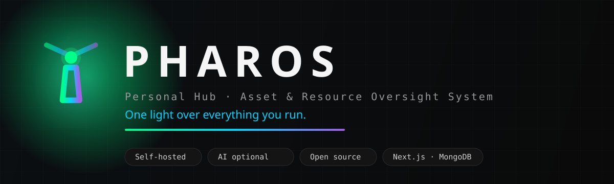

<div align="center">



<p>
  <a href="LICENSE"></a>
  
  
  
  
</p>

**One private dashboard for everything you own and spend.**

*Inventory · receipts · expenses · credit-card installments · subscriptions · vouchers · tasks · network — with optional AI that reads your documents for you.*

</div>

---

## What it is

PHAROS is a self-hosted personal hub. Drop in a receipt photo or a bank-statement
PDF and (optionally) AI reads the vendor, amount, VAT, line items and installment
plans. Track your gear, what you still want to buy (with multi-store price
tracking), recurring bills, warranties, and your home network — all on your own
hardware, behind your own login.

**AI is entirely optional.** Every feature has a manual path, and you choose whether
to use AI at all, which provider, and even which individual features it powers — all
from Settings. No provider configured? The app runs fine and gently points you to the
setup when you're ready.

## Highlights

- **Login + multi-user** — a first-run wizard creates your admin account; add more
  household members (admin / member roles) from Settings. A shared hub, one private gate.
- **Optional AI document parsing** — drop a PDF/photo and AI extracts store, date,
  total, net/VAT, line items and installment plans. OCR fallback with auto-rotation
  for sideways phone photos. Turn it off per-feature or entirely.
- **Inventory & shopping** — what you own vs. what you want, with multi-store price
  tracking, target-price deal alerts, price-history charts, and URL import.
- **Expenses & income** — recurring-series detection, statistical anomaly flags
  (a bill 2× its usual gets a ⚠ badge), per-category monthly budgets.
- **Statements & installments** — parses bank statements, correlates installment
  plans to the products you bought, tracks payoff across months.
- **Money calendar** — one 3-month agenda of renewals, installments, bills, and
  warranty/voucher expiries.
- **Network** — live read-only view of your UniFi gateway (WAN, devices, clients,
  temperatures) with ntfy alerts when a device goes offline.
- **AI command bar** — "add a Netflix subscription", "show this month's stats" in
  plain language (optional; needs a cloud provider).
- **Built for safety** — soft-delete Trash (30-day recovery), backups, SMB/FTP
  mirroring to a NAS, full data export/import.

## Quick start

```bash
git clone https://github.com/youruser/pharos.git
cd pharos
cp .env.example .env
# Generate the two required secrets and paste them into .env:
#   openssl rand -base64 32   →  AUTH_SECRET
#   openssl rand -base64 32   →  NEXT_SERVER_ACTIONS_ENCRYPTION_KEY
#   openssl rand -base64 24   →  MONGO_PASS
docker compose up -d          # web + mongo + searxng
```

Open **http://localhost:3000** and the **first-run wizard** walks you through
creating your admin account, basic preferences, and (optionally) an AI provider.
That's it — no AI key required to get started.

Optional profiles:

```bash
docker compose --profile scraper up -d              # + price scraper + FlareSolverr
docker compose --profile tools up -d mongo-express  # DB admin UI on :8081
```

Local dev (outside Docker):

```bash
cd apps/web
npm install
npm run dev         # http://localhost:3000
npm run type-check  # tsc --noEmit
```

## AI providers (optional)

Pick one in **Settings → AI**, or skip it entirely:

- **Ollama** — fully local, private, free (e.g. `qwen2.5vl:7b` vision + `qwen2.5:14b`
  text). Configurable URL, so the model can run on another box.
- **Anthropic** — Claude, the strongest parsing. Required for the AI command bar.
- **OpenAI · Gemini · OpenRouter** — cloud, vision-capable.
- **Custom** — any OpenAI-compatible server (LM Studio, Groq, Mistral, vLLM…).

A master switch turns AI on/off globally, and each feature (receipt scanning,
statement parsing, product import, the command bar, …) has its own toggle. Every
built-in prompt is editable from Settings.

## Tech stack

| Layer | Choice |
|---|---|
| Framework | Next.js 15 (App Router, RSC, Server Actions, TypeScript strict) |
| Database | MongoDB 7 + Mongoose 8 |
| Auth | Session-cookie (`jose` JWT) + `node:crypto` scrypt password hashing — no external service |
| UI | Tailwind CSS v4, Recharts, lucide-react |
| AI | Pluggable: Ollama / Anthropic / OpenAI / Gemini / OpenRouter / any OpenAI-compatible |
| Containers | Docker Compose (web + Mongo + SearXNG; scraper & tools opt-in) |

## Security model

- **App login required.** All routes — including served receipt/PDF files
  (`/api/files`) — are gated by edge middleware. Unauthenticated requests are
  redirected (pages) or get a 401 (files/API).
- **Passwords** are hashed with `scrypt` (`node:crypto`, no native deps); sessions are
  signed JWTs in an httpOnly cookie. Set `AUTH_COOKIE_SECURE=true` behind HTTPS.
- **Secrets** (AI keys, remote passwords) are stored server-side and never sent to
  the client. Network integration uses a read-only local UniFi user.
- **Untrusted email-HTML receipts** are served with `script-src 'none'` + `nosniff`.
- Still best run behind a VPN / trusted reverse proxy — see [SECURITY.md](SECURITY.md).

## Project structure

```
pharos/
├── docker-compose.yml          # web + mongo + searxng (+ scraper/tools profiles)
├── scripts/                    # backup.sh, migrate.ts, seed, mongo-init.js
├── apps/web/src/
│   ├── app/                    # routes + server actions (login, setup, settings, …)
│   ├── components/             # UI primitives + SiteNav, AiCommandBar, banners
│   ├── lib/                    # db, auth/session, ai providers, aiFeatures, ocr, …
│   ├── models/                 # Mongoose schemas (User, Item, Receipt, …)
│   └── middleware.ts           # the auth gate
└── services/scraper/           # standalone price-scraper worker (cron)
```

## Contributing

Issues and PRs welcome — see [CONTRIBUTING.md](CONTRIBUTING.md) and our
[Code of Conduct](CODE_OF_CONDUCT.md).

## License

[AGPL-3.0](LICENSE). You're free to self-host, study, and modify it; if you run a
modified version as a network service, you must share your source under the same license.

---

<div align="center">
<sub>Built with Next.js, MongoDB, and a lighthouse. 🗼</sub>
</div>
