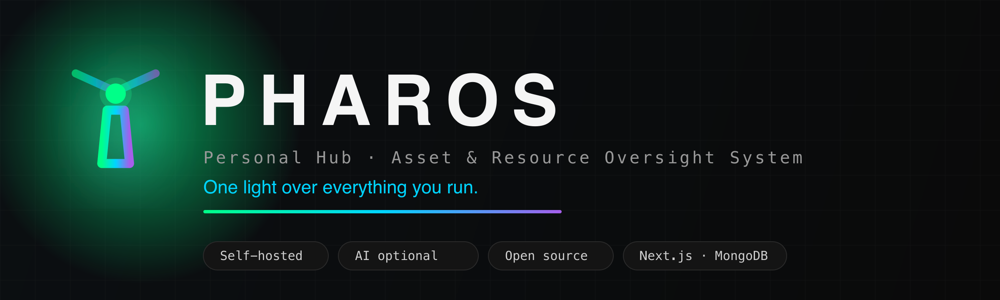

<div align="center">



<p>
  <a href="LICENSE"></a>
  
  
  
  
</p>

**A self-hosted personal hub for everything you own and spend.**

*Inventory · receipts · expenses · bills · subscriptions · statements · documents · backups, with optional AI that reads your paperwork for you.*

</div>

---

## What it is

Keep inventory, receipts, expenses, bills, subscriptions, documents and backups
in one place. Run it for yourself or your household on your own server, with
individual user accounts. AI is optional: every core workflow has a manual path.

## Highlights

- **Household accounts**: a first-run wizard creates the administrator; add
  members and read-only viewers from Settings. One private hub, one login each.
- **Optional AI document reading**: drop in a receipt photo or statement PDF and
  AI extracts the store, date, totals, VAT, line items and installment plans. Use a
  local Ollama model or your own cloud key, or switch AI off per feature or entirely.
- **Inventory & shopping**: what you own and what you want, with multi-store price
  tracking, target-price deal alerts and price history, limited to the shops in
  your shopping country if you like.
- **Expenses & income**: recurring series (including several subscriptions from
  one vendor), unusual-amount flags, price-hike alerts and monthly budgets.
- **Bills, subscriptions & statements**: due dates and partial payments, renewal
  and trial reminders, and card installment plans tracked month by month.
- **Money calendar & reports**: one agenda of what is due, plus cash flow,
  year-over-year and per-space breakdowns.
- **Documents & warranties**: passports, licences and policies with expiry alerts,
  and warranties tracked against the items they cover.
- **Built for safety**: soft-delete Trash with 30-day recovery, JSON backup and
  restore, and optional mirroring of your files to a NAS.

## Screenshots

Screenshots are being prepared using demonstration data.

<!-- Screenshot placeholder: dashboard with sample inventory and upcoming payments. -->
<!-- Screenshot placeholder: expenses list with fictional vendors and amounts. -->
<!-- Screenshot placeholder: receipt review with a synthetic receipt and extracted fields. -->

## Install with Docker Compose

You need Docker with the Compose plugin, Git and OpenSSL. The default stack runs
the web application, MongoDB and SearXNG. Ollama is separate and optional.

```sh
git clone https://github.com/achilleasgkekas/pharos.git
cd pharos
cp .env.example .env
```

Edit `.env` before starting. Generate a **different** value for each secret:

```sh
openssl rand -hex 24      # MONGO_PASS: URL-safe database password
openssl rand -base64 32   # AUTH_SECRET: signs login sessions
openssl rand -base64 32   # NEXT_SERVER_ACTIONS_ENCRYPTION_KEY: keep stable across updates
```

| Setting | What to configure |
| --- | --- |
| `MONGO_USER` | Database administrator username; `admin` matches the example. |
| `MONGO_PASS` | Replace the example password with the generated hex value. |
| `AUTH_SECRET` | Paste its generated value. |
| `NEXT_SERVER_ACTIONS_ENCRYPTION_KEY` | Paste its separate generated value. |
| `AUTH_COOKIE_SECURE` | Leave `false` for local HTTP; set `true` when served over HTTPS. |
| `MONGO_URI` | Compose constructs this from `MONGO_USER`, `MONGO_PASS` and its Mongo service. For a native installation, set the full connection string explicitly. |
| `STORAGE_ROOT` | Compose sets `/storage` and mounts `./data/storage` there. For a native installation, point this at a persistent directory. |

The default Compose file sets the container's `MONGO_URI` and `STORAGE_ROOT`
directly: changing only those two entries in `.env` does not override the Compose
configuration. Keep `.env`, database volumes and stored documents out of Git.

```sh
docker compose up -d --build
```

Open **<http://localhost:3000>** on the server, or its LAN address from another
device. The first-run wizard creates the administrator account, then guides you
through preferences and optional AI configuration. Add household users in Settings.

The web port is published on the host. For remote access, configure your VPN or
an HTTPS reverse proxy, for example `https://pharos.example.com`.
See the [complete installation guide](docs/self-hosting.md) and
[security guide](SECURITY.md).

### Data, backups and updates

MongoDB uses the persistent `mongo-data` volume. Receipt images, statement PDFs
and other files live in `./data/storage`. Back up **both** the database and files;
keep a private copy of your configuration and secrets too. Do not remove volumes
when updating an existing installation.

- [Backup and restore](docs/backup-and-restore.md)
- [Updating and rollback](docs/updating.md)
- [Troubleshooting](docs/troubleshooting.md)

## Optional AI

Pharos works without AI or any provider key. To enable local AI, run Ollama on
your own host, install a suitable model and configure it in Settings → AI. Ollama
uses no cloud API key; the default Docker configuration reaches the host at
`host.docker.internal:11434`.

You may instead connect a supported cloud provider using your own key. Documents
processed by a cloud provider are sent to that provider. The application offers
an optional monthly budget based on estimated AI spend; also configure spending
controls with your provider. You can switch AI off or enable it only for selected
features.

See [configuration](docs/configuration.md) for AI, storage mirrors and notifications.

## Documentation and integrations

- [Documentation index](docs/README.md)
- [Features](docs/features.md)
- [REST API and MCP](docs/api.md)
- [Browser extension](apps/extension/README.md)
- [Contributing](CONTRIBUTING.md) and [Code of Conduct](CODE_OF_CONDUCT.md)

## License

Pharos is licensed under **AGPL-3.0-only**. See [LICENSE](LICENSE) for the complete terms.
